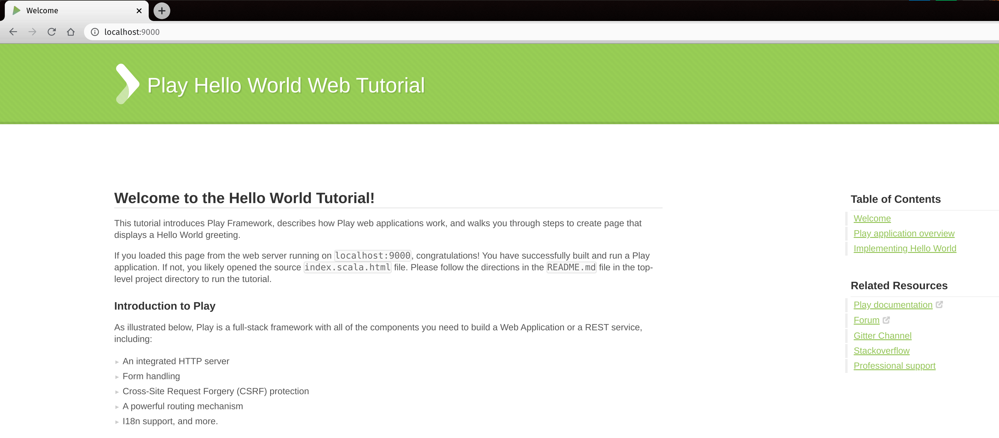

# 3. Play Framework Tutorial - Part 1-2 - Hello World

1. After the downloaded zip file is unzipped and opened in Intellij, the folder structure and files are shown as below.

<p align="center">
 
    <br>
    <em>Folder Structure of Play Project</em>
</p>

> It will take quite a while to download all related dependencies for this project.

<p align="center">
 
    <br>
    <em>Project Dependencies</em>
</p>

2. Git verson control can be enabled in the Intellij for better version control.
3. `.gitignore` file can be updated if more files to be excluded.
4. Without Change anything of project further, we can run the project directly. 
5. Right click on the `built.sbt` and click on the  `Run Play 2 App`. The project will take some time to build and open a page in browser `http://localhost:9000/` by default. 

<p align="center">
 
    <br>
    <em>Sample Start Page for Play Framework</em>
</p>

6. __Good__! This means our Play Framework and sample project works. 
7. Next step as hello world tutorial, we are going to add something in the project and return a json string
- for home page, we will return a json string to show the status.
<p align="center">
 
    <br>
    <em>Sample Start Page for Play Framework After change</em>
</p>

- for hello page, we will return a json string to include the query parameter.

<p align="center">
 
    <br>
    <em>Sample Hello Page for Play Framework After change</em>
</p>

8. How to implement these two features?
- define the response action in the controller.  `app/controllers/HomeController`
- define corresponding routes in the `conf/routes`

Implementation of `app/controllers/HomeController`:

```scala
import play.api.libs.json._

def index(): Action[AnyContent] = Action { implicit request: Request[AnyContent] =>

    val json:JsValue = Json.parse(
      """{
        |"status" : "Okay",
        |"type": "index"
        |}""".stripMargin)

    Ok(json)
  }

  def hello(name: String): Action[AnyContent] = Action {
    val json:JsValue = Json.parse(
      s"""{
        |"status" : "Okay",
        |"type": "hello",
        |"name": "$name"
        |}""".stripMargin)

    Ok(json)
  }
```
here we defined two actions: `index()`and `hello(name: String)`. Now we want to link the route to these two actions.

```text
GET     /                                   controllers.HomeController.index
GET     /hello                         controllers.HomeController.hello(name: String)
```
9. Save the file and we can test the link. If the `Play 2 App` is not running, we can follow  step 5 to re-run the app again. 
10. Play has an advantage that the change does not require terminate the app. It will do the change automatically. 
11. We can use Postman to do some testing.

<p align="center">
 
    <br>
    <em>Postman testing home page</em>
</p>

<p align="center">
 
    <br>
    <em>Postman testing hello page</em>
</p>